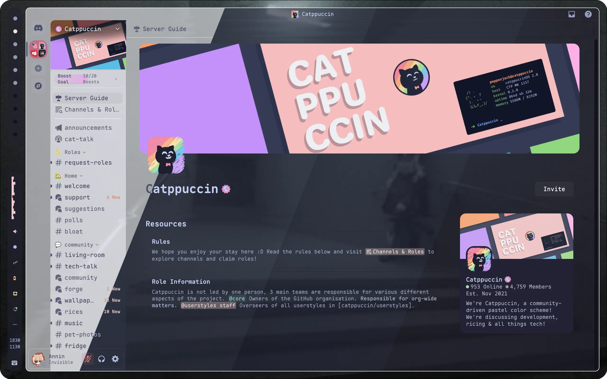
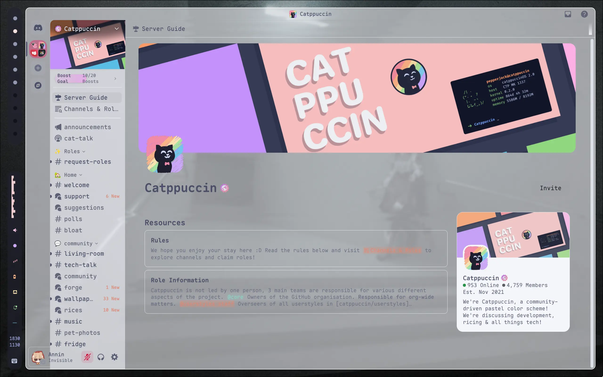
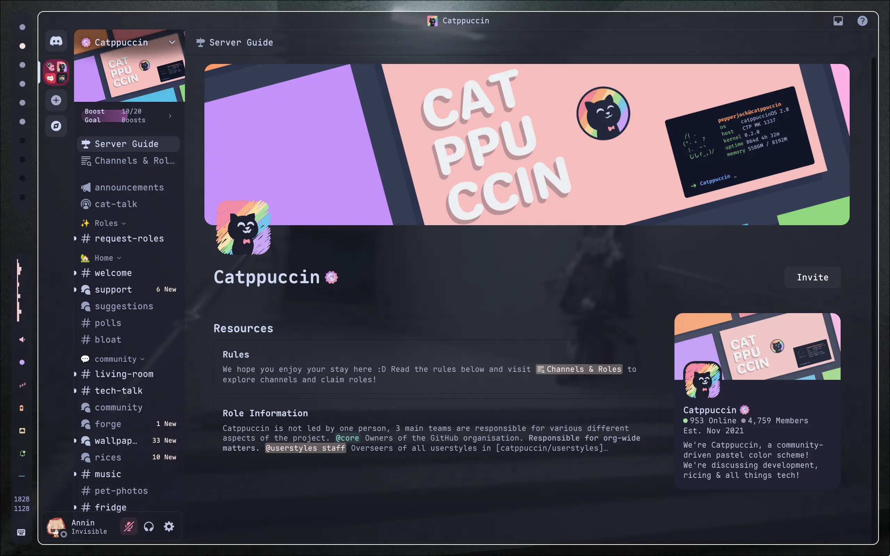

<h3 align="center">
	<br/>
	
	Catppuccin for <a href="https://discord.com/">Discord</a>
	
</h3>

<p align="center">
    <a href="https://github.com/anninzy/catppuccin-discord-transparent/stargazers"></a>
    <a href="https://github.com/anninzy/catppuccin-discord-transparent/issues"></a>
    <a href="https://github.com/anninzy/catppuccin-discord-transparent/contributors"></a>
</p>



## Previews

<details>
<summary>🌻 Latte</summary>

</details>
<details>
<summary>🪴 Frappé</summary>

</details>
<details>
<summary>🌺 Macchiato</summary>

</details>
<details>
<summary>🌿 Mocha</summary>

</details>

## Usage

### [BetterDiscord](https://betterdiscord.app)

1. Download your preferred flavour:

- 🌻 [Latte](./themes/latte.theme.css?raw=1)
- 🪴 [Frappe](./themes/frappe.theme.css?raw=1)
- 🌺 [Macchiato](./themes/macchiato.theme.css?raw=1)
- 🌿 [Mocha](./themes/mocha.theme.css?raw=1)

2. Copy the downloaded file to your BetterDiscord themes folder.
3. Enable the theme in BetterDiscord settings.

### [Vencord](https://vencord.dev)

1. Paste the following link into `Settings -> Themes -> Online Themes`

```
https://anninzy.github.io/catppuccin-discord-transparent/dist/catppuccin-mocha.theme.css
```

### Clients/Mods with custom CSS support

1. Simply add your preferred flavour into your discord clients CustomCSS file/editor.

```css
/* latte */
@import url("https://anninzy.github.io/catppuccin-discord-transparent/dist/catppuccin-latte.theme.css");
/* frappe */
@import url("https://anninzy.github.io/catppuccin-discord-transparent/dist/catppuccin-frappe.theme.css");
/* macchiato */
@import url("https://anninzy.github.io/catppuccin-discord-transparent/dist/catppuccin-macchiato.theme.css");
/* mocha */
@import url("https://anninzy.github.io/catppuccin-discord-transparent/dist/catppuccin-mocha.theme.css");

/* You can also append Catppuccin colors to customize the accent, e.g. */
/* mocha (pink accent)*/
@import url("https://anninzy.github.io/catppuccin-discord-transparent/dist/catppuccin-mocha-pink.theme.css");
/* frappe (maroon accent) */
@import url("https://anninzy.github.io/catppuccin-discord-transparent/dist/catppuccin-frappe-maroon.theme.css");
```

## 🙋 FAQ

- Q: **_"Can this get my account banned?"_**
- A: Using third party clients and injecting custom css is against the ToS. While nobody has ever been banned for simply using discord client mods, We are not responsible for anything that might happen to your account by using third party clients. Use at your own discretion!

- Q: **_"Can I automatically switch flavors between light and dark mode?"_**
- A: The following snippet showcases a configuration that switches between latte in light mode and mocha in dark mode by adding an inline [`prefers-color-scheme` media feature](https://developer.mozilla.org/en-US/docs/Web/CSS/@media/prefers-color-scheme), `(prefers-color-scheme: <light-or-dark>)`, after each `@import` statement (see ["Importing CSS rules conditional on media queries" - MDN](https://developer.mozilla.org/en-US/docs/Web/CSS/@import#importing_css_rules_conditional_on_media_queries)).

  ```css
  @import url("https://anninzy.github.io/catppuccin-discord-transparent/dist/catppuccin-mocha.theme.css")
  (prefers-color-scheme: dark);
  @import url("https://anninzy.github.io/catppuccin-discord-transparent/dist/catppuccin-latte.theme.css")
  (prefers-color-scheme: light);
  ```

- Q: **_"Can I disable Rainbow Threads"_**
- A: Yes, by placing the following in your QuickCSS threads will be the same colour as typical channels. *note: please respect the `space` between the colon and semi-colon*

  ```css
  :root {
    --ctp-rainbow-thread-disabled: ;
  }
  ```

- Q: **_"Why is it not transparent?"_**
- A: Remember to enable transparency in the settings. For Vencord, that will be `Settings -> Vencord -> Enable window transparency`.

- Q: **_This doesn't have anything to do with Catppuccin but how do I use system font?_**
- A: Paste the following into your discord clients CustomCSS file/editor.

  ```css
  * {
      font-family: sans !important;
  }
  ```

## 💝 Thanks to

- [GlowingUmbreon](https://github.com/glowingumbreon)
- [Isabelinc](https://github.com/Isabelincorp)
- [Ren](https://github.com/watatomo)
- [winston](https://github.com/nekowinston)
- [rubyowo](https://github.com/rubyowo)
- [Aven](https://github.com/ToxicAven)

&nbsp;

<p align="center"></p>
<p align="center">Copyright &copy; 2021-present <a href="https://github.com/catppuccin" target="_blank">Catppuccin Org</a>
<p align="center"><a href="https://github.com/catppuccin/catppuccin/blob/main/LICENSE"></a></p>
