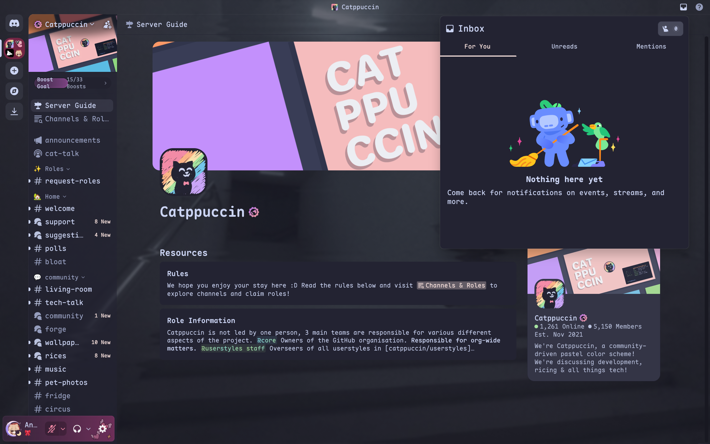

<h3 align="center">
	 
	
	Catppuccin for <a href="https://discord.com/">Discord</a>
	
</h3>

> [!IMPORTANT]
> The `fork` (originally `main`) branch is no longer maintained

## Note

This was originally a fork of the catppuccin repo, but I don't need to keep
rebasing if I just override the variables after importing the theme.

I use Mocha Rosewater so that's the only theme included, PRs welcomed to
modularize for different flavors.

## Usage

Refer to [catppuccin/discord](https://github.com/catppuccin/discord) and replace
the link with the raw link of the .css file in this repo.
